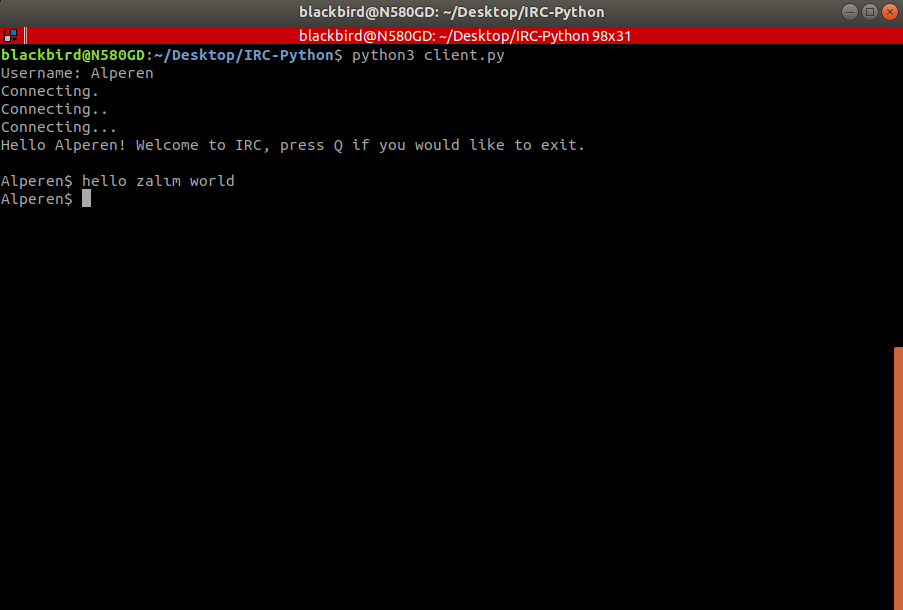

# Internet Relay Chat Python Implementation 


Basic IRC application based on low level socket programming and multithreading  
  
mySocket class
```python
class mySocket(object):
    def __init__(self 
                ,sock
                ,name 
                ,ip
                ,port         = 4242
                ,family       = socket.AF_INET
                ,protocol     = socket.SOCK_STREAM
                ,encoding     = 'utf-8'
                ,headerSize   = 4 
                ,isServer     = False
    ):                         
        self._SOCK            = sock
        self.name             = name
        self.ip               = ip 
        self.port             = port
        self.family           = family
        self.protocol         = protocol
        self._ENCODING        = encoding
        self._HEADER_SIZE     = headerSize
        self.isServer         = isServer
        self.receivedMessages = 0                  # Number of messages
        self.sentBytes        = 0
        self.receivedBytes    = 0                  # Without header!
        self.numClients       = 0
        self.clients          = dict()

    def initialize(self):
        self._SOCK = socket.socket(self.family, self.protocol)
        self._SOCK.bind((self.ip, self.port))
        print("Server initialized"
             ,f"[IP] {self.ip}"
             ,f"[Port] {self.port}"
             ,sep = "\n")
        
    def listen(self, num):    
        self._SOCK.listen(num)

    def accept(self):
        self.numClients += 1
        client, clientAddr = self._SOCK.accept()
        self.clients[clientAddr[0]] = client      # ip adress => key, client socket => value
        return (client, clientAddr)

    def send(self, message):
        pass
    
    def receive(self, clientSocket):
        packetSizeRaw = clientSocket.recv(HEADER_SIZE)
        packetSizeString = packetSizeRaw.decode(encoding=ENCODING).split()[0]
        packetSize = int(packetSizeString, 10)
        
        messageRaw = clientSocket.recv(packetSize)
        message = messageRaw.decode(encoding=ENCODING)
        self.receivedMessages += 1
        self.receivedBytes += packetSize
        return message
```
  
> # Installation and Running Server


># Client Side  



> Any contribution would be appreciated
